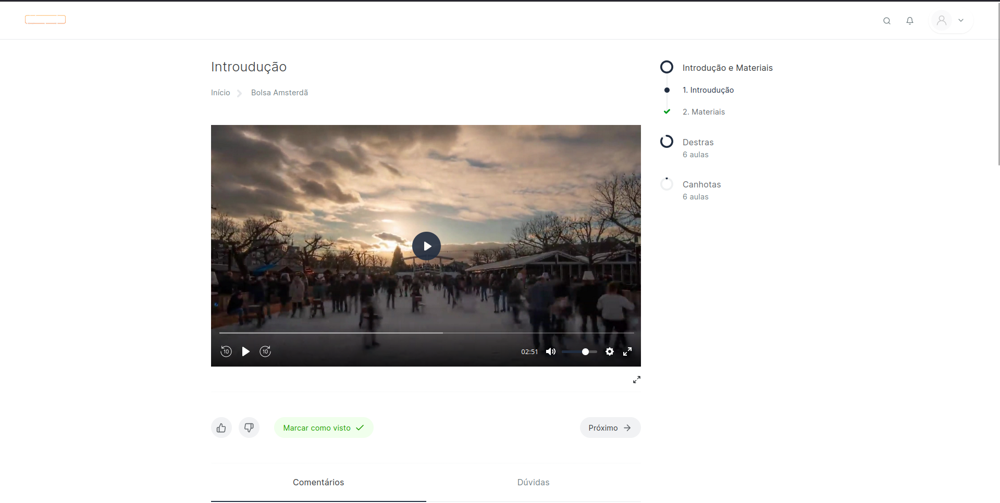

3° Heuristica - Controle e Liberdade do Usuário.

Não há uma maneira explicita para o usuário voltar a uma tela anterior ou para tela inicial, de maneira a não gastar tempo pensando em como retroceder.

---

8° Heuristica - Design Estético Minimalista.

Existe um alinhamento ruim nas colunas da tabelas tornando difícil de identificar qual é a coluna que se está referindo.

---

8° Heuristica - Design Estético Minimalista.

Problema de design, devido a cor do texto tornando difícil para o usuário ler seu contéudo.

---

4° Heuristica - Consistência e Padrões.

O intuito do site é demonstrar os diferentes processos que estão ocorrendo e as etapas, porém utiliza a mesma cor para todos os estados fazendo os parecer que são equivalentes.

8° Heuristica - Design Estético Minimalista.

Problema de design, devido a cor do texto que informa as unidades de processos, tornando difícil para o usuário ler seu contéudo.

---

8° Heuristica - Design Estético Minimalista.

Problema de design, pois você tem uma tabela que não tem nenhum critério de ordenação.

---

3° Heuristica - Controle e Liberdade do Usuário.

Não há uma maneira explicita para o usuário sair apenas da conta logada.

---

5° Heuristica - Prevenções de Erros.

O usuário pode acabar cometendo algum erro devido a falta de clareza no design do app. podendo levar ao usuário a cometar uma ação errada e uma incerteza sobre que ele está fazendo.

---

5° Heuristica - Prevenções de Erros.

O usuário pode acabar cometendo algum erro devido a ícone do atendimento que fica encima do botão para finalizar comprando pode fazer o usuário cometer um erro.

